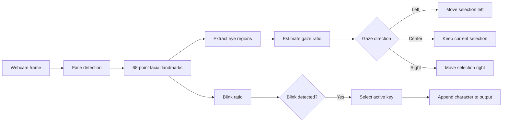

# Eye-Gaze Controlled User Interface

A computer-vision prototype for hands-free human-computer interaction using webcam-based eye-gaze and blink detection.

The project captures live webcam video, detects facial landmarks with dlib, estimates gaze direction from the eye region, and maps gaze/blink patterns to an on-screen keyboard. The main prototype supports left/center/right gaze navigation and blink-based key selection.

## What It Demonstrates

- Real-time webcam processing with OpenCV
- Face and eye landmark detection with dlib
- Eye-gaze estimation from thresholded eye regions
- Blink detection from facial landmark geometry
- Gaze-driven navigation across a virtual keyboard
- Blink-based character selection
- Audio feedback using Pyglet
- A simple hands-free interaction workflow

## How It Works



## Core Interaction

The main implementation uses both eyes to estimate a gaze ratio and classifies the user's gaze into left, center, or right. A highlighted key moves through the virtual keyboard based on gaze direction. A detected blink selects the currently active character.

The keyboard prototype contains 15 keys arranged in a 5 × 3 grid:

```text
Q W E R T
A S D F G
Z X C V B
```

## Repository Files

| File | Purpose |
| --- | --- |
| `main.py` | Main combined gaze/blink-controlled keyboard prototype |
| `gaze_controlled_keyboard_p9.py` | Earlier gaze-controlled keyboard implementation |
| `keyboard.py` | Standalone virtual-keyboard drawing prototype |
| `backup.py` | Historical development snapshot |
| `backup2.py` | Historical development snapshot |
| `backup3.py` | Historical development snapshot |

The extra scripts are intentionally retained as part of the original development history.

## Tech Stack

- Python
- OpenCV
- dlib
- NumPy
- Pyglet

## Requirements

Install the Python dependencies:

```bash
python -m pip install -r requirements.txt
```

The prototype also expects the following local assets:

```text
shape_predictor_68_face_landmarks.dat
sound.wav
left.wav
right.wav
```

`shape_predictor_68_face_landmarks.dat` is the dlib 68-point facial-landmark model. The audio files are used for interaction feedback.

## Running

Place the required model/audio assets in the repository root, then run:

```bash
python main.py
```

The application opens the default webcam and displays OpenCV windows for the camera feed, gaze feedback, virtual keyboard, and typed output.

Press `Esc` to exit.

## Implementation Notes

The project uses a lightweight geometric approach rather than a trained end-to-end gaze model:

1. Detect a face in each webcam frame.
2. Predict 68 facial landmarks.
3. Use eye landmarks to construct each eye region.
4. Threshold the eye image and compare white-pixel counts on its left and right halves.
5. Average the two-eye gaze measurements.
6. Classify the gaze into left, center, or right.
7. Compute a blink ratio from landmark distances.
8. Use gaze to navigate and blinking to select a key.

This was developed as an experimental HCI/computer-vision project and is not intended as a production eye-tracking or accessibility system.

## Limitations

- Uses heuristic gaze/blink thresholds that may require calibration for different users, cameras, and lighting conditions.
- Depends on frontal-face landmark detection.
- Uses the default webcam.
- The repository preserves the original prototype-style implementation rather than presenting a production-ready library.
- External model and audio assets are required to reproduce the original behavior.

## Project Context

This repository is preserved as an earlier computer-vision/HCI project. The code remains close to the original implementation; the repository documentation and supporting metadata were added later to make the work easier to understand and evaluate.
